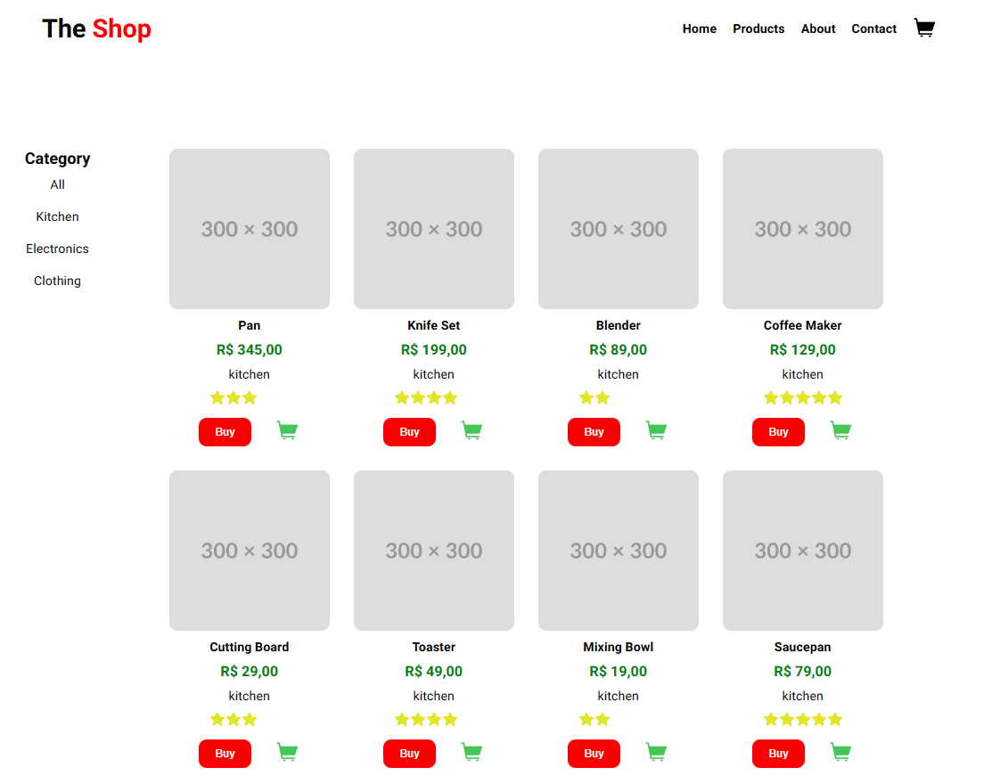
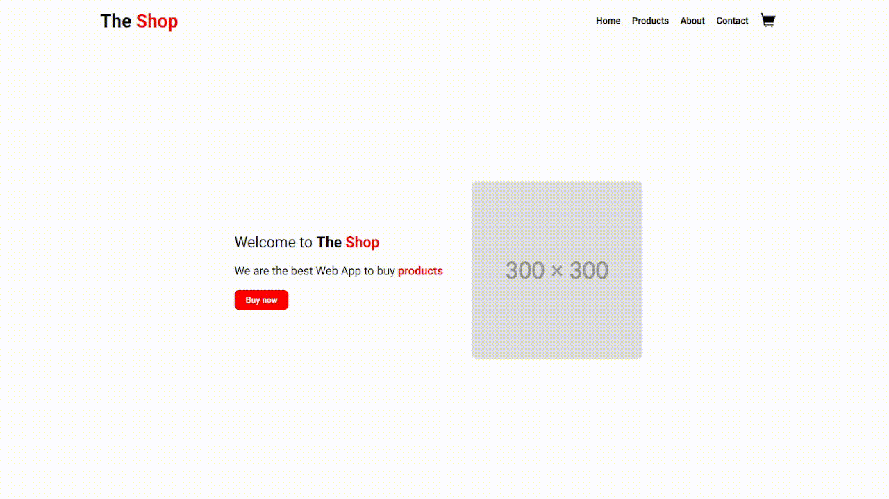
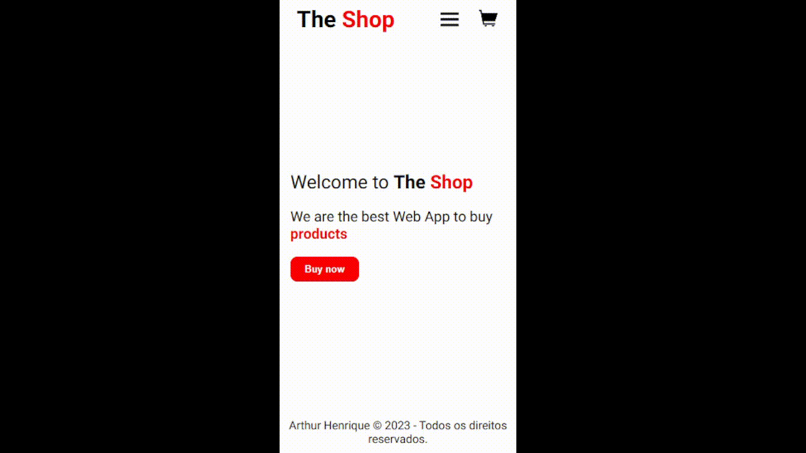

<h1 align="center">
  The Shop
</h1>

  <a href="#-tecnologias">Tecnologias</a>&nbsp;&nbsp;&nbsp;|&nbsp;&nbsp;&nbsp;
  <a href="#-projeto">Projeto</a>&nbsp;&nbsp;&nbsp;|&nbsp;&nbsp;&nbsp;
  <a href="#-layout">Layout</a>&nbsp;&nbsp;&nbsp;|&nbsp;&nbsp;&nbsp;
  <a href="#-como-executar">Como executar</a>&nbsp;&nbsp;&nbsp;|&nbsp;&nbsp;&nbsp;
  <a href="#-executando-a-aplicação">Executando a aplicação</a>

## 🚀 Tecnologias

Esse projeto foi desenvolvido com as seguintes tecnologias:

- [Angular](https://angular.io/)    

- [TypeScript](https://www.javascript.com/)    

## 💻 Projeto

The Shop é um projeto no qual permite ao usuário ter um local seguro e bem estruturado para que possa realizar a compras de vários produtos, que estão organizados por categoria.

## ✨ Layout

  

## 🔖 Como executar

- Clone o repositório
- Instale as dependências com `npm`
- Inicie o servidor com `npm run start`

Agora você pode acessar [`localhost:4200`](http://localhost:4200) do seu navegador.

## 🎬 Executando a aplicação

  

## 📱 Resposividade Mobile

  

